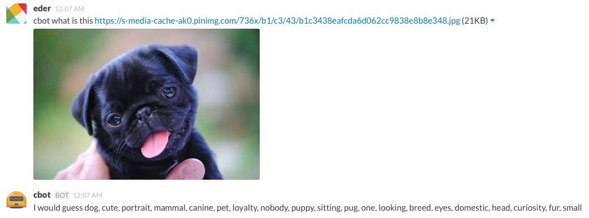

# hubot-clarifai

[](https://travis-ci.org/gfax/hubot-clarifai)
[](https://david-dm.org/gfax/hubot-clarifai)

- [Installation](#installation)
- [Usage](#usage)
- [Development and testing](#development-and-testing)



A hubot script to recognize images; powered by [Clarifai].
This is a re-write of [hubot-recognizer](https://github.com/jaythomas/hubot-recognizer) to work with the new Clarifai API.

## Installation

1. Register on [Clarifai] for an API key if you don't have one. They're free.

2. Export your API key as an environment variable:

```bash
export CLIENT_ID=HugeCR4zyV4luesTh3yW1!!g1veU
```

3. In your hubot project folder, install the node module:

```bash
# Using yarn
yarn add hubot-clarifai
# Or with npm
npm install --save hubot-clarifai
```

4. Then add **hubot-clarifai** to your `external-scripts.json`:

```json
[
  "hubot-clarifai"
]
```

## Usage

hubot what is [image url]

hubot what is this [image url]


# Development and testing

You can load up the hubot CLI adapter by running `npm start`.
This will load the script automatically where you can trigger a response from it.

Also you can run `npm run test` to run eslint.

[Clarifai]: https://www.clarifai.com/
